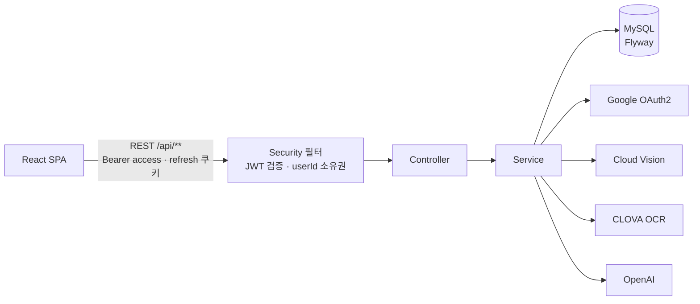
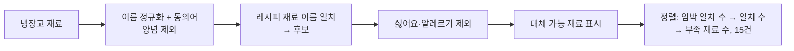
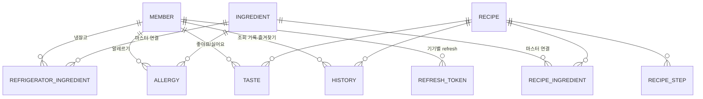

# 오늘도 썩는 중 (CookIt) — Backend

**식재료 사진·영수증을 인식해 냉장고를 관리하고, 냉장고 재료로 만들 수 있는 레시피를 추천하는 서비스**의 백엔드입니다.
HICC 2025 상반기 프로젝트 대회 출품작입니다.

- 프론트엔드: [HICC-2025-1-PC-TEAM5/frontend](https://github.com/HICC-2025-1-PC-TEAM5/frontend)

## 주요 기능

| 기능 | 설명 |
|------|------|
| 재료 인식 | 식재료 **사진**(Google Cloud Vision 라벨 → OpenAI)이나 **영수증**(CLOVA OCR → OpenAI)에서 재료 이름·분류를 뽑습니다. 결과는 바로 저장하지 않고 사용자가 확인·수정한 뒤 등록합니다 |
| 냉장고 관리 | 재료를 재료 마스터(1,072종)에 연결해 분류를 정하고, **분류 × 보관방식(실온·냉장실·냉동고)** 표로 소비기한을 자동 계산합니다. 사용자가 입력한 기한이 있으면 그 값을 씁니다 |
| 레시피 추천 | 식품안전나라 레시피 1,156건을 DB에 미리 적재해 두고, 냉장고 재료와 **이름이 일치하는** 레시피를 찾습니다. 소비기한 임박 재료를 많이 쓰는 레시피가 먼저 나옵니다 |
| 개인화 필터 | **싫어요** 표시한 레시피와 **알레르기** 재료(동의어·대체 재료 포함)가 들어간 레시피는 추천에서 뺍니다 |
| 안내 | 기한이 지난 재료가 레시피에 쓰이면 확인 안내를, 없는 재료를 냉장고의 다른 재료로 대신할 수 있으면 대체 가능 안내를 함께 줍니다 |
| 기록 | 레시피 조회 기록, 즐겨찾기, 좋아요/싫어요, 알레르기 관리 |
| 로그인 | Google OAuth2 + JWT. access 토큰은 클라이언트 메모리에만 두고, refresh 토큰은 HttpOnly 쿠키 + DB 해시 저장(로테이션, 로그아웃 시 무효화) |

## 기술 스택

| 영역 | 사용 기술 |
|------|-----------|
| Language / Framework | Java 21, Spring Boot 3.4.7 |
| Data | Spring Data JPA, MySQL 8.4, Flyway 11 |
| Security | Spring Security, OAuth2 Client(Google), JWT(jjwt 0.11.5) |
| 외부 연동 | OpenAI Chat API(`gpt-4.1`, WebClient), Google Cloud Vision, Naver CLOVA OCR, ImageMagick(HEIC → JPG) |
| Test | JUnit 5, Mockito, Testcontainers(MySQL) |
| Infra | Docker, Docker Compose |

## 시스템 구성



요청 처리 중에 외부 API를 부르는 곳은 **재료 인식과 로그인뿐**입니다. 레시피 추천·상세는 로컬 DB만 읽어 외부 장애와 분리되어 있습니다.

### 레시피 추천 흐름



레시피마다 같은 재료를 다르게 적는 문제(`계란`/`달걀`, `대파(흰부분)` 등)는 `RecipeIngredientParser`의 규칙 정규화와 동의어 사전(`recipe/ingredient-aliases.csv`)으로 같은 이름에 맞춥니다. 대신 쓸 수 있는 재료는 별도 사전(`recipe/ingredient-substitutes.csv`)으로 구분합니다.

### 데이터 모델



- 사용자 데이터(냉장고·알레르기·취향·기록)와 미리 적재하는 기준 데이터(재료 마스터, 레시피)로 나뉩니다.
- 냉장고 재료·레시피 재료·알레르기는 FK가 아니라 **정규화한 이름**으로 비교합니다. 마스터 FK는 분류·영양성분에 씁니다.
- 초기 설계 다이어그램: [ER 다이어그램](ERdiagram.drawio.png), [클래스 다이어그램](hiccClassDiagram.drawio.png) (현재 스키마와 일부 다름)

## 프로젝트 구조

```
src/main/java/hicc_project/RottenToday/
├── controller/   # Auth, Session, User, Ingredient, VisionApi, Recipe
├── service/      # 도메인 로직, 외부 API 호출
│   └── recipe/   # CSV 적재, 재료 이름 정규화(RecipeIngredientParser)
├── repository/   # Spring Data JPA
├── entity/       # 엔티티 + 한글 enum(Category, StorageCondition, Appetite)
├── dto/          # 요청·응답 DTO (엔티티를 응답에 직접 담지 않음)
├── security/     # JwtAuthenticationFilter, UserPathAccessInterceptor
├── config/       # Security, CORS, HTTP 클라이언트, 레시피 적재 러너
└── exception/    # GlobalExceptionHandler → {error, message}

src/main/resources/
├── config/application.properties   # 공통 설정 (git 포함)
├── application.properties          # 비밀값 (git 제외, 직접 작성)
├── db/migration/                    # Flyway V1~V4
└── recipe/                          # 동의어·대체 재료 사전

scripts/
├── seed/    # 재료 마스터 SQL, 레시피 CSV(COOKRCP01.csv.gz)
└── bench/   # 성능 측정 스크립트, 개발용 토큰 발급
```

## API

모든 사용자 API는 `/api/users/{userId}/…` 아래에 있고, 로그인한 사용자 본인의 `userId`만 호출할 수 있습니다(다르면 403, 남의 데이터 id면 404).

| 구분 | 메서드·경로 |
|------|-------------|
| 로그인 | `GET /api/v2/oauth2/google`, `GET /api/v2/oauth2/google/callback` |
| 세션 | `POST /api/auth/refresh`, `POST /api/auth/logout` |
| 내 정보 | `GET·DELETE /api/users/me` |
| 재료 인식 | `POST /fridge/image-to-ingredients`(사진), `POST /fridge/receipt-to-ingredients`(영수증) |
| 냉장고 | `GET·POST·PATCH /fridge/ingredients`, `GET·DELETE /fridge/ingredients/{id}`, `GET /fridge/necessary` |
| 재료 마스터 | `GET /ingredientlist`, `GET /ingredientlist/{ingredientId}` |
| 레시피 | `GET /recipes`(추천), `GET /recipes/{recipeId}`(상세) |
| 취향 | `GET·POST·DELETE /preference`, `GET·POST /preference/allergy`, `DELETE /preference/allergy/{allergyId}` |
| 기록 | `GET·POST /history`, `GET·POST /history/favorites` |

오류 응답은 `{ "error": "BAD_REQUEST", "message": "사용자에게 보여 줄 한글 문구" }` 형식입니다. 500은 고정 문구만 내려가고 상세는 서버 로그에만 남습니다.

## 로컬 실행

### 1. 준비

- Docker, Docker Compose (JDK 21을 설치하지 않아도 됩니다)
- `src/main/resources/application.properties` (git 제외) — 아래 키를 채웁니다

  ```properties
  spring.datasource.url / username / password
  app.jwt.secret
  app.frontend.main-url
  spring.security.oauth2.client.registration.google.client-id / client-secret / scope
  app.oauth.google.redirect-uri
  openai.url / openai.key
  clova.ocr.url / clova.ocr.secret
  cloud.aws.credentials.access-key / secret-key, cloud.aws.region.static, cloud.aws.s3.bucket
  ```

- `secrets/google-vision.json` — Google Cloud Vision 서비스 계정 키 (사진 인식에 필요)
- `.env.example`을 `.env`로 복사해 DB 이름·계정·포트를 채웁니다

### 2. 실행

```bash
docker compose up --build
```

MySQL과 앱이 함께 뜨고, 스키마는 Flyway가 만듭니다. 기본 포트는 앱 8080, MySQL 3307입니다(`.env`의 `APP_PORT`, `MYSQL_PORT`로 변경).

### 3. 기준 데이터 적재 (빈 DB에서 한 번)

재료 마스터 — 앱을 한 번 기동해 테이블이 생긴 뒤 실행합니다. 여러 번 실행해도 결과가 같습니다.

```bash
docker compose exec -T mysql sh -c 'mysql -u"$MYSQL_USER" -p"$MYSQL_PASSWORD" "$MYSQL_DATABASE"' < scripts/seed/ingredient_master.sql
```

레시피 1,156건 — `recipe-import` 프로파일로 CSV를 적재하고 종료합니다. 다시 실행해도 결과가 같습니다(RCP_SEQ 기준 upsert). macOS·Linux는 `$(pwd -W)` 대신 `$(pwd)`를 쓰고 `MSYS_NO_PATHCONV=1`을 뺍니다.

```bash
MSYS_NO_PATHCONV=1 docker compose run --rm --no-deps -v "$(pwd -W)/scripts/seed/COOKRCP01.csv.gz:/app/import/COOKRCP01.csv.gz:ro" -e SPRING_PROFILES_ACTIVE=recipe-import -e RECIPE_IMPORT_CSV_PATH=/app/import/COOKRCP01.csv.gz app
```

JDK 21이 있으면 Docker 없이 `./gradlew bootRun`(Windows: `gradlew.bat bootRun`)으로도 실행할 수 있습니다. 이때는 `application.properties`의 DB 주소를 직접 띄운 MySQL로 맞춥니다. 영수증의 HEIC 사진을 처리하려면 ImageMagick(`magick`)이 필요합니다.

## 테스트

```bash
./gradlew test
```

- 서비스 로직은 Mockito 단위 테스트, 쿼리·스키마는 Testcontainers MySQL 테스트로 검증합니다. Docker가 없으면 DB 테스트는 건너뜁니다.
- 외부 API(OpenAI, Vision, OCR)는 모두 목으로 대체해 실제로 호출하지 않습니다.
- 비밀값 파일(`application.properties`) 없이도 전체 테스트가 돌아갑니다.
- 호스트에 JDK 21이 없으면 컨테이너에서 실행합니다(Docker 소켓 마운트 필요).

  ```bash
  MSYS_NO_PATHCONV=1 docker run --rm -v "$(pwd -W)":/w -v cookit-gradle-cache:/root/.gradle -v /var/run/docker.sock:/var/run/docker.sock -e TESTCONTAINERS_HOST_OVERRIDE=host.docker.internal -w /w eclipse-temurin:21-jdk ./gradlew test
  ```

## 개선 기록

대회 이후 진행한 주요 개선입니다.

| 문제 | 개선 | 결과 |
|------|------|------|
| 추천할 때마다 식품안전나라 API를 실시간 호출하고 결과를 매번 새로 저장 | 레시피 CSV를 미리 적재하고 로컬 DB만 조회 | 추천 응답 평균 131~150 ms → 26~39 ms, 요청당 저장 0건 |
| 레시피마다 재료 표기가 달라 `계란`으로 적힌 레시피가 달걀 알레르기에 걸리지 않음 | 재료 이름 정규화 + 동의어 사전, 재료 마스터 보강 | 달걀 알레르기 사용자에게 나가던 계란 레시피 15건 → 0건, 마스터와 이름이 맞는 재료 조각 52.6% → 89.1% |
| 스키마를 `ddl-auto`로 관리해 변경 이력이 없음 | Flyway 마이그레이션 + `validate`, 실제 MySQL로 테스트 | 스키마 변경이 버전별 SQL로 남음 |
| 목록 조회에서 행마다 연관 데이터를 따로 조회(N+1) | 연관 데이터 묶어 조회, 기본 재료 한 번에 조회 | 조회 기록 SQL 104 → 5회, 평균 26 → 7 ms (측정용 회원 기준) |
| 로그아웃해도 refresh 토큰이 14일간 유효 | refresh 토큰 해시를 DB에 저장, 사용 시 교체, 로그아웃 시 삭제 | 로그아웃·교체된 토큰 재사용 시 401 |
| 외부 API 키가 소스에 하드코딩 | 설정 파일로 이동 | 소스에 키 없음 |

## 팀 소개

| [조준연](https://github.com/GJYeon) | [임장원](https://github.com/magnetogithub) |
|----------------------------------|-----------------------------------------|
| BE                               | BE                                      |
